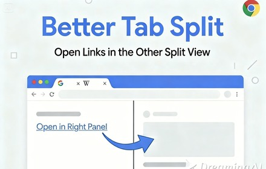
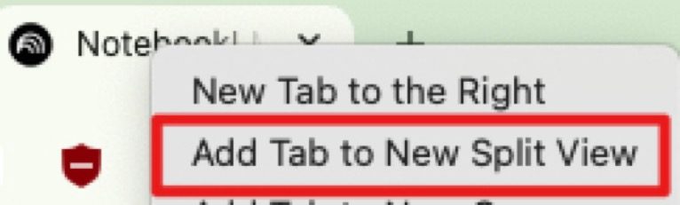
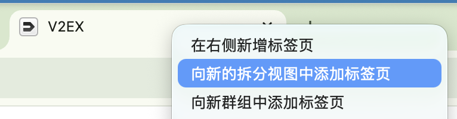
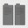
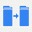

# Better Tab Split

A Chrome extension that opens links in the opposite pane when in Split View, instead of a new tab.

一个 Chrome 扩展，让你在拆分视图（一个 tab 左右分屏双开页面）中点击链接时，在另一侧打开而不是新标签页。

## Installation

## Prerequisites

Make sure you have Chrome 142 or higher and enabled Split View feature.

## Icon Status

Just click the icon to toggle the extension on and off.

| Icon | Status | Description |
|:----:|--------|-------------|
|  | Disabled | Current tab is not using Split View |
|  | Off | Split View is enabled, but extension is off |
|  | On | Split View is enabled and extension is active |

点击图标即可切换扩展功能的开启/关闭状态。

| 图标 | 状态 | 说明 |
|:----:|------|------|
|  | 禁用 | 当前标签页未启用拆分视图 |
|  | 关闭 | 拆分视图已启用，但扩展功能关闭 |
|  | 开启 | 拆分视图已启用，扩展功能开启 |

## License

MIT License
